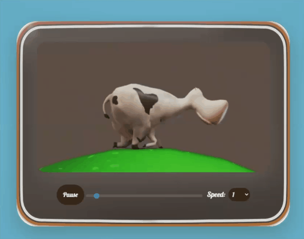

<p align="center">
   
</p>

# VideoPlayer

This player is part of a video from [Mario Souto](https://www.linkedin.com/in/omariosouto/) from [Alura](https://www.alura.com.br/) and consists on a videoplayer made with [React](https://reactjs.org). As a challenge, [Mario Souto](https://www.linkedin.com/in/omariosouto/) asked us to implement the Playback Rate on Video Player.

**PS**: This video is from a game that I´m working on. If you like it, please, follow me on:

* [Behance](https://www.behance.net/cledman)
* [Instagram](https://www.instagram.com/cledman.art/)
* [Dribbble](https://dribbble.com/cledman)
* [DeviantArt](https://www.deviantart.com/cledman)

---

# Guide

* [Features](#features)
* [Installation](#installation)
* [Technologies](#technologies)
* [Future Implementations](#future-implementations)


# Features

*  Users can play and pause vídeos.
*  **PLUS**: Now users can change the playback rate!


# Installation

**You will need install:**

 [Node.js](https://nodejs.org/en/download/) <br />
 [Npm](https://www.npmjs.com/) 

**Install dependencies**

```npm install```

**Run the application in a development environment:**

```npm start```

# Technologies

* [NodeJS](https://nodejs.org/en/) to handle the server, 
* [React](https://reactjs.org) to handle the rendering, 

# Future Implementations

*  Users could change audio volume.

Thanks to [Mario Souto](https://www.linkedin.com/in/omariosouto/) from [Alura](https://www.alura.com.br/).
##

